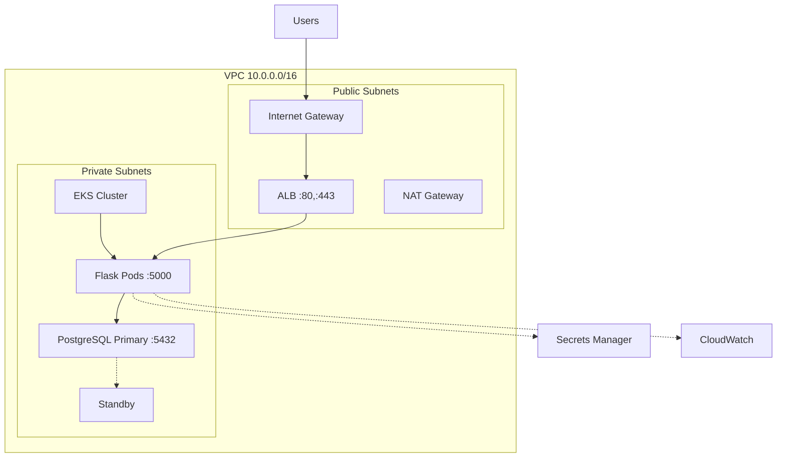

# AI Prompt for AWS Infrastructure Diagram

## Prompt for AI Image Generation

```
Create a professional AWS architecture diagram for a Flask API with these components:

VPC (10.0.0.0/16) containing:

PUBLIC SUBNETS (2 AZs):
- Internet Gateway
- Application Load Balancer (ports 80, 443)
- NAT Gateway

PRIVATE SUBNETS (2 AZs):
- EKS Cluster with 3-5 EC2 nodes (t3.small/medium)
- Kubernetes pods running Flask app (port 5000, HPA 2-10 replicas)
- RDS PostgreSQL 15.4 Multi-AZ (port 5432, primary + standby)

AWS SERVICES (side panel):
- Secrets Manager, CloudWatch, IAM, S3, DynamoDB

CONNECTIONS:
- Internet → IGW → ALB → EKS Pods → RDS Primary
- Pods → Secrets Manager (dotted)
- All → CloudWatch (dotted)
- Private → NAT → IGW (outbound)

STYLE: Use official AWS icons, orange/blue color scheme, show security groups, Multi-AZ badges, and port numbers. Title: "Titanic API - AWS Infrastructure"
```

## Diagram-as-Code

### Python (diagrams library):

```python
from diagrams import Diagram, Cluster
from diagrams.aws.compute import EKS, EC2
from diagrams.aws.database import RDS
from diagrams.aws.network import ALB, InternetGateway, NATGateway
from diagrams.aws.security import SecretsManager, IAM
from diagrams.aws.management import Cloudwatch

with Diagram("Titanic API - AWS", show=False):
    with Cluster("VPC"):
        igw = InternetGateway("IGW")
        with Cluster("Public Subnets"):
            alb = ALB("ALB")
            nat = NATGateway("NAT")
        with Cluster("Private Subnets"):
            eks = EKS("EKS")
            nodes = [EC2("Node") for _ in range(3)]
            db = RDS("PostgreSQL")
            db_standby = RDS("Standby")
    
    secrets = SecretsManager("Secrets")
    cw = Cloudwatch("CloudWatch")
    
    igw >> alb >> nodes >> db
    nodes >> secrets
    nodes >> cw
```

### Mermaid:



## Lucidchart/Draw.io Instructions:

```
1. SETUP:
   - Import AWS Architecture Icons (2023 set)
   - Canvas size: 1920x1080 or A4 landscape
   - Grid: 10px with snap enabled

2. CREATE VPC CONTAINER:
   - Large rounded rectangle for VPC
   - Label: "VPC (10.0.0.0/16)"
   - Color: Light blue (#E3F2FD)

3. PUBLIC SUBNETS SECTION (Top half):
   - Two rectangles side-by-side labeled "Public Subnet AZ-1" and "AZ-2"
   - Color: Light green (#C8E6C9)
   - Add icons:
     * Internet Gateway (top center)
     * Application Load Balancer (center)
     * NAT Gateway (bottom right)
   - Add labels: Port 80, 443

4. PRIVATE SUBNETS SECTION (Bottom half):
   - Two rectangles side-by-side labeled "Private Subnet AZ-1" and "AZ-2"
   - Color: Light purple (#F3E5F5)
   
   EKS Cluster box:
   - Add EKS icon
   - Add 3 EC2 instance icons
   - Add 4-6 pod icons (hexagons)
   - Label: "Titanic API Pods - Port 5000"
   - Add HPA icon with scaling arrows
   
   RDS box:
   - Add 2 RDS database icons
   - Connect with dotted line (replication)
   - Labels: "Primary", "Standby", "PostgreSQL 15.4", "Port 5432"

5. AWS SERVICES PANEL (Right side):
   - Vertical stack of icons:
     * Secrets Manager
     * CloudWatch
     * IAM
     * S3
     * DynamoDB

6. CONNECTIONS:
   - Blue arrows: Internet → IGW → ALB → Pods
   - Purple arrows: Pods → Database
   - Dotted lines: Pods → Secrets Manager, CloudWatch
   - Dotted line: IAM → EKS
   - Red arrow: NAT → IGW (outbound)

7. ANNOTATIONS:
   - Add text boxes for ports, instance types, scaling info
   - Add security group shields with rules
   - Add "Multi-AZ", "Encrypted" badges

8. LEGEND (Bottom right):
   - Traffic Flow (solid arrow)
   - Replication (dotted line)
   - Monitoring (dashed line)

9. TITLE:
   - Top center: "Titanic API - AWS Infrastructure Architecture"
   - Subtitle: "Multi-AZ High Availability Deployment"
```
