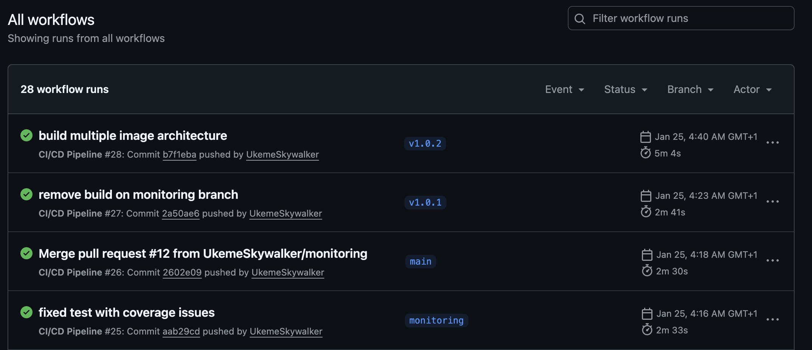
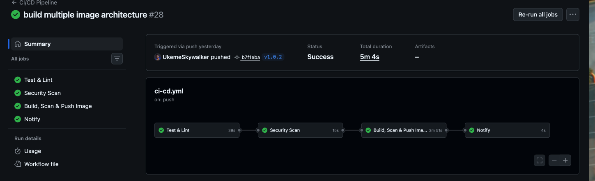
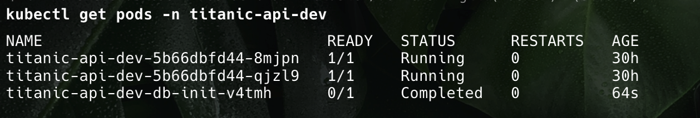
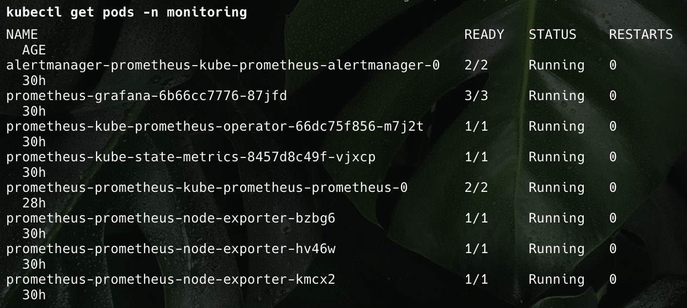
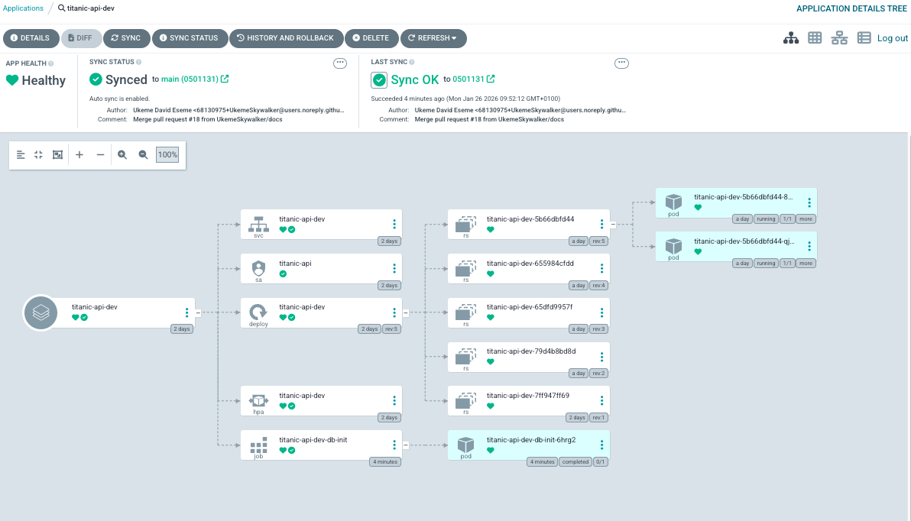
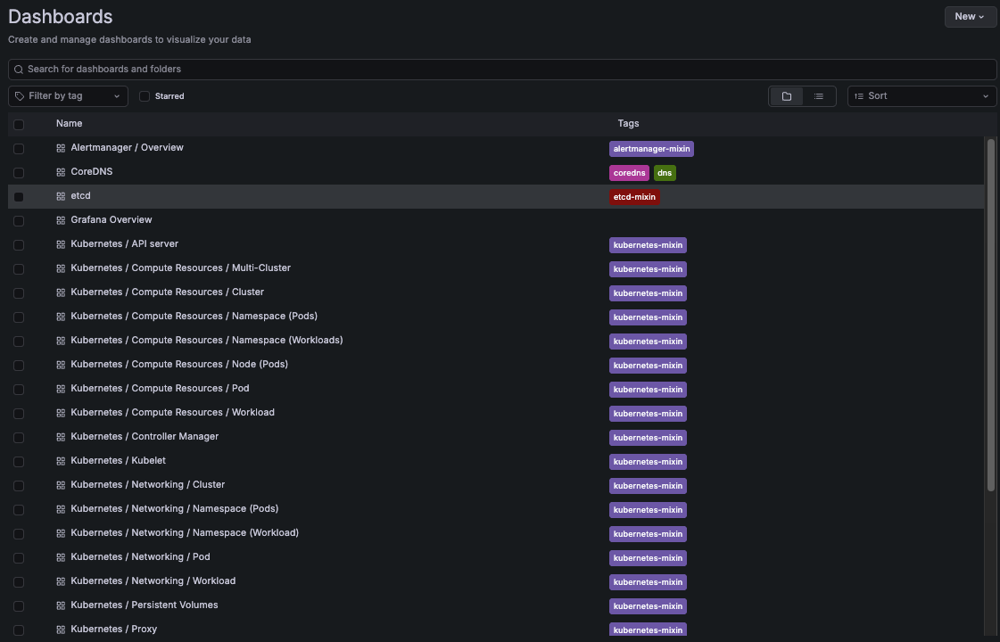
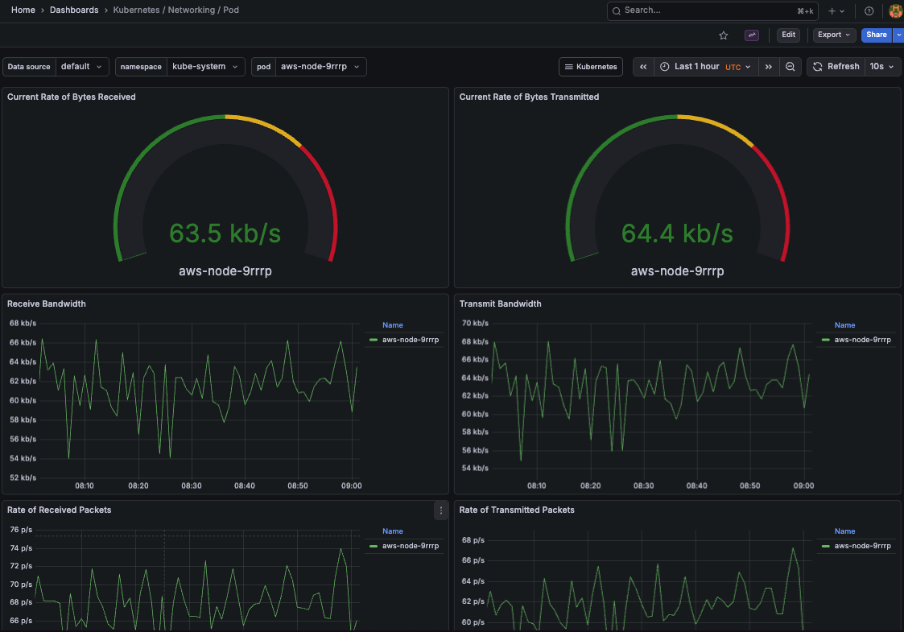

# Titanic API

Production-ready Flask REST API for Titanic passenger data with complete AWS infrastructure, Kubernetes deployment, and observability.


## Overview

A microservice built with Flask that provides CRUD operations for Titanic passenger data. Fully deployed on AWS EKS with PostgreSQL RDS, complete CI/CD pipeline, GitOps with ArgoCD, and comprehensive monitoring with Prometheus and Grafana.

## Architecture

```
Developer → GitHub → CI/CD Pipeline → Docker Hub → ArgoCD → EKS Cluster
                          ↓                           ↓
                    Tests + Security Scan      Auto-sync Deployment
                          ↓                           ↓
                   Multi-tag Images            Prometheus Monitoring
```

## Tech Stack

- **Application**: Flask, SQLAlchemy, PostgreSQL
- **Infrastructure**: AWS (EKS, RDS, VPC, Secrets Manager), Terraform
- **Container**: Docker (multi-stage builds)
- **Orchestration**: Kubernetes, Helm
- **GitOps**: ArgoCD with Argo Rollouts
- **Monitoring**: Prometheus, Grafana, AlertManager
- **CI/CD**: GitHub Actions

---

## Project Structure

```
titanic-api/
├── src/                           # Flask application
│   ├── models/                   # SQLAlchemy models
│   ├── views/                    # API endpoints
│   ├── app.py                    # Application factory
│   └── config.py                 # Configuration
├── infra/                         # Terraform infrastructure
│   ├── modules/
│   │   ├── eks/                  # EKS + EBS CSI + StorageClass
│   │   ├── rds/                  # PostgreSQL database
│   │   ├── vpc/                  # Network infrastructure
│   │   ├── iam/                  # IAM roles (IRSA)
│   │   └── secrets/              # Secrets Manager
│   ├── environments/
│   │   ├── dev/terraform.tfvars
│   │   ├── staging/terraform.tfvars
│   │   └── prod/terraform.tfvars
│   └── deploy.sh                 # Deployment script
├── k8s/                           # Kubernetes manifests
│   ├── helm/titanic-api/         # Helm chart
│   │   ├── values.yaml
│   │   ├── values-dev.yaml
│   │   ├── values-staging.yaml
│   │   └── values-prod.yaml
│   ├── argocd/
│   │   ├── applications/         # ArgoCD apps
│   │   └── rollouts/             # Argo Rollouts
│   ├── monitoring/
│   │   ├── values-dev.yaml       # Prometheus config
│   │   ├── prometheus-rules.yaml # Alert rules
│   │   ├── dashboards/           # Grafana dashboards
│   │   └── deploy-monitoring.sh
│   ├── deploy-app.sh
│   └── sync-secrets.sh
├── .github/workflows/
│   └── ci-cd.yml                 # CI/CD pipeline
├── tests/                         # Unit tests
├── Dockerfile                     # Production build
├── docker-compose.yml             # Local development
└── requirements.txt               # Python dependencies
```

---

## Environments

| Environment | Purpose | Auto-Deploy | Rollout Strategy |
|-------------|---------|-------------|------------------|
| **Dev** | Development & testing | ✅ Yes | Rolling update |
| **Staging** | Pre-production validation | ✅ Yes | Rolling update |
| **Prod** | Production workloads | ❌ Manual | Blue-green |

---

## 1. Local Development

### Description
Develop and test the Flask application locally with hot-reload capabilities. Uses Docker Compose to run the application and PostgreSQL database in containers.

### Tools & Resources
- **Python 3.11** with Flask framework
- **PostgreSQL** database
- **Docker Compose** for local orchestration
- **pytest** for testing
- **flake8** and **black** for code quality

### Quick Start
```bash
# Clone repository
git clone https://github.com/UkemeSkywalker/titanic-api.git
cd titanic-api

# Setup environment
cp .env.example .env

# Start services
docker-compose up -d --build

# View logs
docker-compose logs -f app

# Test API
curl http://localhost:5000/people
```

### Key Scripts
- `run.py` - Application entry point
- `docker-compose.yml` - Development environment
- `docker-compose.dev.yml` - Development with hot-reload
- `docker-compose.prod.yml` - Production-like local setup

### API Endpoints
```bash
# Health check
GET /health

# Get all people
GET /people

# Create person
POST /people
{
  "survived": 1,
  "passengerClass": 1,
  "name": "John Doe",
  "sex": "male",
  "age": 30,
  "siblingsOrSpousesAboard": 0,
  "parentsOrChildrenAboard": 0,
  "fare": 50.0
}
```

### Testing
```bash
# Run tests
pytest tests/ --cov=src --cov-report=term

# Lint code
flake8 src/
black --check src/
```

📖 **Detailed guide**: [Local development setup](INSTALLATION_GUIDE.md)

---

## 2. Docker & Container Setup

### Description
Multi-stage Docker builds optimized for security and size. Images are built with non-root user, minimal base image (python:3.11-slim), and security scanning. Final image size < 200MB.

### Tools & Resources
- **Docker** with BuildKit
- **Multi-stage builds** (builder + production)
- **Trivy** for security scanning
- **Docker Hub** for image registry

### Image Build Process
```bash
# Local build
docker build -t titanic-api:local .

# Production build
docker build -f Dockerfile -t titanic-api:prod .

# Check image size
docker images titanic-api
```

### Security Features
- ✅ Non-root user (`appuser` UID 1000)
- ✅ Minimal base image (python:3.11-slim)
- ✅ No cache directories
- ✅ Layer optimization
- ✅ Security scanning with Trivy

### Key Files
- `Dockerfile` - Production multi-stage build
- `Dockerfile.dev` - Development with hot-reload
- `.dockerignore` - Exclude unnecessary files

📖 **Detailed guide**: [DOCKER.md](DOCKER.md)

---

## 3. Infrastructure (Terraform)

### Description
Complete AWS infrastructure provisioned with Terraform using workspaces for multi-environment management. Includes EKS cluster, RDS PostgreSQL, VPC networking, IAM roles, and Secrets Manager integration.

### Tools & Resources
- **Terraform** (v1.0+) with S3 backend
- **AWS CLI** for authentication
- **Terraform Workspaces** (dev, staging, prod)
- **Modules**: VPC, EKS, RDS, IAM, Secrets

### Infrastructure Components

| Component | Dev | Staging | Prod |
|-----------|-----|---------|------|
| **EKS Nodes** | 3x t3.small | 3x t3.small | 3x t3.medium |
| **RDS Instance** | db.t3.micro | db.t3.small | db.t3.medium |
| **VPC CIDR** | 10.0.0.0/16 | 10.1.0.0/16 | 10.2.0.0/16 |
| **Kubernetes** | 1.33 | 1.33 | 1.33 |

### Prerequisites

**Install required tools**
```bash
brew install terraform awscli kubectl
```
**Configure AWS credentials**
```
aws configure
```

### Deployment

```bash
cd infra

#Initialize S3 backend & DynamoDb Table for state locking
./scripts/setup-backend.sh

# Deploy full infrastructure with environment options
./deploy.sh <dev|staging|prod> apply

# Deploy specific module (conditionally optional)
./deploy.sh <dev|staging|prod> apply module.eks

# Destroy infrastructure
./deploy.sh <dev|staging|prod> destroy
```

### Key Scripts
- `deploy.sh` - Main deployment script with workspace management
- `scripts/setup-backend.sh` - Initialize S3 backend
- `scripts/sync-secrets.sh` - Sync secrets to AWS Secrets Manager

### Modules
- **eks/** - EKS cluster, node groups, EBS CSI driver, gp3 StorageClass
- **rds/** - PostgreSQL database with automated backups
- **vpc/** - VPC, subnets, NAT gateway, route tables
- **iam/** - IAM roles with IRSA for pod-level permissions
- **secrets/** - AWS Secrets Manager for database and SMTP credentials

📖 **Click the links below for detailed technical guides**:
- [Infrastructure Setup](infra/README.md)
- [Quick Start](infra/QUICKSTART.md)
- [Security Best Practices](infra/SECURITY.md)
- [Disaster Recovery](infra/DISASTER_RECOVERY.md)
- [Cost Optimization](infra/COST_OPTIMIZATION.md)

---

## 4. CI/CD Pipeline (GitHub Actions)

### Description
Automated CI/CD pipeline that runs on every push to main/dev branches or when theirs a release tag.
Performs testing, linting, security scanning, builds Docker images with multiple tags, pushes to Docker Hub, and then sends a notification via email on the state of the pipeline [success/failure]. 
Images are then picked up by ArgoCD for deployment.

### Tools & Resources
- **GitHub Actions** for CI/CD orchestration
- **pytest** with coverage (>70% required)
- **flake8** and **black** for code quality
- **Trivy** for vulnerability scanning
- **Docker Hub** for image registry
- **Email notifications** on pipeline status

### Pipeline Stages

#### 1. Test & Lint
```yaml
- Run pytest with coverage (>70%)
- Lint with flake8
- Format check with black
- PostgreSQL service container for tests
```

#### 2. Security Scan
```yaml
- Trivy filesystem scan
- Upload results to GitHub Security
```

#### 3. Build & Push Docker Image
```yaml
- Multi-stage Docker build
- Trivy image scan
- Push to Docker Hub with tags:
  - main (branch name)
  - sha-abc1234 (commit SHA)
  - pr-4 (PR number)
  - latest (on main branch)
```

#### 4. Notify
```yaml
- Email notification on success/failure
```


### Image Tagging Strategy
```bash
# Branch-based
ukemzyskywalker/titanic-api:main
ukemzyskywalker/titanic-api:dev

# Commit SHA
ukemzyskywalker/titanic-api:sha-abc1234

# Pull Request
ukemzyskywalker/titanic-api:v1.0.2

# Latest (main branch only)
ukemzyskywalker/titanic-api:latest
```

### Triggering Pipeline
```bash
# Push to main/dev
git push origin main

# Create pull request
gh pr create --base main --head feature/new-feature
```

### Key Files
- `.github/workflows/ci-cd.yml` - Main CI/CD pipeline
- `scripts/setup-cicd.sh` - Configure GitHub secrets

### Required GitHub Secrets
```
DOCKER_USERNAME
DOCKER_PASSWORD
POSTGRES_USER
POSTGRES_PASSWORD
EMAIL_USERNAME
EMAIL_PASSWORD
EMAIL_TO
```

📖 **Detailed guide**: [.github/CICD.md](.github/CICD.md)

---

## 5. Kubernetes Deployment


### Description
Application deployed to EKS using Helm charts with environment-specific configurations. Includes HPA for auto-scaling, rolling updates for zero-downtime deployments, and integration with AWS Secrets Manager for credentials.

### Tools & Resources
- **Helm 3** for package management
- **kubectl** for cluster interaction
- **AWS EKS** (Kubernetes 1.33)
- **Horizontal Pod Autoscaler** (HPA)
- **AWS Secrets Manager** integration

### Deployment Architecture
```
EKS Cluster
├── Namespace: titanic-api-dev
│   ├── Deployment (2-10 replicas with HPA)
│   ├── Service (LoadBalancer)
│   ├── ServiceAccount (IRSA)
│   └── Secret (from AWS Secrets Manager)
├── Namespace: monitoring
│   ├── Prometheus
│   ├── Grafana
│   └── AlertManager
└── Namespace: argocd
    └── ArgoCD
```

### Deployment Process
```bash
# 1. Configure kubectl
aws eks update-kubeconfig --name dev-eks --region us-east-1

# 2. Sync secrets from AWS
cd k8s
./sync-secrets.sh dev

# 3. Deploy application
./deploy-app.sh dev

# 4. Verify deployment
kubectl get pods -n titanic-api-dev
kubectl get svc -n titanic-api-dev
```

### Helm Chart Structure
```
k8s/helm/titanic-api/
├── Chart.yaml
├── values.yaml              # Default values
├── values-dev.yaml          # Dev overrides
├── values-staging.yaml      # Staging overrides
├── values-prod.yaml         # Prod overrides
└── templates/
    ├── deployment.yaml
    ├── service.yaml
    ├── serviceaccount.yaml
    ├── hpa.yaml
    └── secret.yaml
```

### Environment-Specific Configuration

| Setting | Dev | Staging | Prod |
|---------|-----|---------|------|
| **Replicas** | 1 (min) | 3 (min) | 5 (min) |
| **Max Replicas** | 10 | 15 | 20 |
| **CPU Request** | 250m | 250m | 500m |
| **Memory Request** | 256Mi | 256Mi | 512Mi |
| **CPU Limit** | 500m | 500m | 1000m |
| **Memory Limit** | 512Mi | 512Mi | 1Gi |

### Key Scripts
- `deploy-app.sh` - Deploy application to specific environment
- `sync-secrets.sh` - Sync secrets from AWS Secrets Manager
- `db-init-job.yaml` - Database initialization job

📖 **Detailed guides**:
- [Kubernetes Deployment](k8s/DEPLOYMENT.md)
- [Database Initialization](k8s/DB_INIT.md)

---

## 6. ArgoCD (GitOps)

### Description
GitOps continuous deployment using ArgoCD. Automatically syncs Kubernetes manifests from Git repository to EKS cluster. Supports blue-green deployments with Argo Rollouts for production.

### Tools & Resources
- **ArgoCD** for GitOps
- **Argo Rollouts** for progressive delivery
- **GitHub** as source of truth
- **Helm** for templating

### ArgoCD Applications

| Application | Namespace | Sync Policy | Environment |
|-------------|-----------|-------------|-------------|
| **titanic-api-dev** | titanic-api-dev | Auto-sync | Dev |
| **titanic-api-staging** | titanic-api-staging | Auto-sync | Staging |
| **titanic-api-prod** | titanic-api-prod | Manual | Production |

### Installation
```bash
cd k8s

# Install ArgoCD
./install-argocd.sh

# Access ArgoCD UI
kubectl port-forward -n argocd svc/argocd-server 8080:443

# Get admin password
kubectl get secret argocd-initial-admin-secret -n argocd \
  -o jsonpath='{.data.password}' | base64 -d
```

### Deployment Flow
```
1. Developer pushes code → GitHub
2. CI/CD builds image → Docker Hub (sha-abc1234)
3. Update Helm values → Git commit (image.tag: sha-abc1234)
4. ArgoCD detects change → Auto-sync (dev/staging)
5. ArgoCD deploys → EKS cluster
6. Argo Rollouts → Blue-green deployment (prod)
```

### Blue-Green Deployment (Production)
```bash
# Argo Rollout automatically:
1. Deploys new version (green)
2. Runs analysis (Prometheus metrics)
3. Promotes if healthy
4. Rolls back if unhealthy
```

### Key Files
- `k8s/argocd/applications/dev.yaml` - Dev application
- `k8s/argocd/applications/staging.yaml` - Staging application
- `k8s/argocd/applications/prod.yaml` - Prod application
- `k8s/argocd/rollouts/prod-rollout.yaml` - Blue-green strategy
- `k8s/argocd/rollouts/analysis-template.yaml` - Metrics analysis

### ArgoCD Commands
```bash
# Sync application
argocd app sync titanic-api-dev

# Get application status
argocd app get titanic-api-dev

# Rollback
argocd app rollback titanic-api-dev
```

📖 **Detailed guide**: [k8s/argocd/README.md](k8s/argocd/README.md)

---

## 7. Monitoring & Observability



### Description
Complete monitoring stack with Prometheus for metrics collection, Grafana for visualization, and AlertManager for email notifications. Monitors application performance, resource utilization, and sends alerts for critical issues.

### Tools & Resources
- **Prometheus** for metrics collection
- **Grafana** for dashboards
- **AlertManager** for notifications
- **prometheus-flask-exporter** for app metrics
- **AWS Secrets Manager** for SMTP credentials

### Monitoring Architecture
```
Flask App → Prometheus Metrics → Prometheus Server
                                        ↓
                                  Grafana Dashboard
                                        ↓
                                  AlertManager → Email
```

### Installation
```bash
cd k8s/monitoring

# 1. Deploy EBS CSI driver (via Terraform)
cd ../../infra
./deploy.sh dev apply module.eks

# 2. Deploy monitoring stack
cd ../k8s/monitoring
./deploy-monitoring.sh dev
```

### Grafana Dashboard (6 Panels)
1. **Request Rate** - Real-time throughput per namespace
2. **Request Latency** - P50, P95, P99 percentiles
3. **Error Rate** - 4xx and 5xx error tracking
4. **CPU Utilization** - Per-pod CPU usage
5. **Memory Utilization** - Per-pod memory consumption
6. **Pod Status** - Running pod count gauge

### Alert Rules (8 Rules)

| Severity | Alert | Condition | Duration |
|----------|-------|-----------|----------|
| 🔴 **Critical** | HighErrorRate | >5% error rate | 5 min |
| 🔴 **Critical** | PodCrashLooping | Pod restarting | 5 min |
| 🔴 **Critical** | PodNotReady | Pod not running | 10 min |
| 🔴 **Critical** | DatabaseConnectionFailure | High 500 errors | 2 min |
| ⚠️ **Warning** | HighLatency | P95 >1s | 5 min |
| ⚠️ **Warning** | HighMemoryUsage | >85% memory | 5 min |
| ⚠️ **Warning** | HighCPUUsage | >85% CPU | 5 min |
| ℹ️ **Info** | LowRequestRate | Very low traffic | 10 min |

### Email Notifications Setup
```bash
# 1. Apply Terraform to create secret placeholder
cd infra
./deploy.sh dev apply module.secrets

# 2. Store SMTP credentials in AWS Secrets Manager
cd ../k8s/monitoring
./store-smtp-secret.sh dev

# 3. Sync secrets to Kubernetes
./sync-alertmanager-secrets.sh dev

# 4. Configure AlertManager
./configure-email-alerts.sh dev
```

### Access Dashboards
```bash
# Grafana (default: admin/admin)
kubectl port-forward -n monitoring svc/prometheus-grafana 3000:80
# http://localhost:3000

# Prometheus
kubectl port-forward -n monitoring svc/prometheus-kube-prometheus-prometheus 9090:9090
# http://localhost:9090

# AlertManager
kubectl port-forward -n monitoring svc/prometheus-kube-prometheus-alertmanager 9093:9093
# http://localhost:9093
```

### Key Scripts
- `deploy-monitoring.sh` - Deploy complete monitoring stack
- `install-monitoring.sh` - Install Prometheus & Grafana
- `store-smtp-secret.sh` - Store SMTP credentials in AWS
- `sync-alertmanager-secrets.sh` - Sync SMTP secrets to K8s
- `configure-email-alerts.sh` - Configure AlertManager

### Resource Allocation

| Component | Dev | Staging | Prod |
|-----------|-----|---------|------|
| **Prometheus** | 200m/400Mi | 250m/512Mi | 500m/1Gi |
| **Grafana** | 100m/128Mi | 100m/192Mi | 200m/256Mi |
| **Retention** | 7 days | 15 days | 30 days |
| **Storage** | 10Gi (gp3) | 20Gi (gp3) | 50Gi (gp3) |

📖 **Detailed guides**:
- [Monitoring Stack](k8s/monitoring/README.md)
- [Email Alerts Setup](k8s/monitoring/EMAIL_ALERTS.md)

---

## 8. Cost Optimization

### Description
Strategies and tools to optimize AWS infrastructure costs while maintaining performance and reliability. Includes resource right-sizing, auto-scaling, spot instances, and cost monitoring.

### Current Cost Estimates

| Environment | Monthly Cost | Key Services |
|-------------|--------------|-------------|
| **Dev** | ~$175 | EKS ($73), EC2 ($30), RDS ($15), NAT ($32) |
| **Staging** | ~$175 | EKS ($73), EC2 ($30), RDS ($15), NAT ($32) |
| **Prod** | ~$401 | EKS ($73), EC2 ($95), RDS ($120), NAT ($32) |
| **Total** | **~$751/month** | |

### Key Optimization Strategies

#### 1. Spot Instances (Save 70%)
```hcl
# Use spot instances for non-prod
capacity_type = "SPOT"
instance_types = ["t3.small", "t3a.small", "t2.small"]
```
**Savings**: ~$87/month


#### 4. Auto-Scaling
- Horizontal Pod Autoscaler (HPA) - Already configured
- Cluster Autoscaler - Scale nodes based on pod demand
- RDS Auto-scaling - Storage grows automatically

**Savings**: ~$50/month

#### 5. Right-Sizing
```bash
# Monitor actual resource usage
kubectl top nodes
kubectl top pods -n titanic-api-dev

# Downsize if CPU/Memory < 40%
```
**Savings**: ~$30/month

### Tools & Resources
- **AWS Cost Explorer** - Visualize spending patterns
- **AWS Budgets** - Set alerts for cost thresholds
- **AWS Cost Anomaly Detection** - Detect unusual spending
- **CloudWatch Metrics** - Monitor resource utilization
- **Terraform Cost Estimation** - Preview infrastructure costs

### Cost Monitoring
```bash
# View monthly costs by service
aws ce get-cost-and-usage \
  --time-period Start=2024-01-01,End=2024-01-31 \
  --granularity MONTHLY \
  --metrics BlendedCost \
  --group-by Type=SERVICE

# Set budget alert
aws budgets create-budget \
  --account-id 123456789012 \
  --budget file://budget.json
```

### Target Costs After Optimization

| Environment | Before | After | Savings |
|-------------|--------|-------|--------|
| **Dev** | $175 | $75 | 57% |
| **Staging** | $175 | $75 | 57% |
| **Prod** | $401 | $250 | 38% |
| **Total** | **$751** | **$400** | **47%** |

### Quick Wins
1. ✅ Enable Spot Instances for dev/staging
2. ✅ Schedule shutdown for non-prod environments
3. ✅ Delete unused EBS snapshots (>30 days)
4. ✅ Enable S3 Intelligent-Tiering
5. ✅ Use S3 Gateway Endpoint (free)
6. ✅ Implement CloudWatch Logs retention (7 days)
7. ✅ Right-size instances based on metrics
8. ✅ Purchase Reserved Instances for prod

📖 **Detailed guide**: [Cost Optimization](infra/COST_OPTIMIZATION.md)

---

## Complete Deployment Workflow

### First-Time Setup
```bash
# 1. Clone repository
git clone https://github.com/UkemeSkywalker/titanic-api.git
cd titanic-api

# 2. Deploy infrastructure
cd infra
./deploy.sh dev apply

# 3. Configure kubectl
aws eks update-kubeconfig --name dev-eks --region us-east-1

# 4. Install ArgoCD
cd ../k8s
./install-argocd.sh

# 5. Sync database secrets
./sync-secrets.sh dev

# 6. Deploy application
./deploy-app.sh dev

# 7. Deploy monitoring
cd monitoring
./deploy-monitoring.sh dev

# 8. Configure email alerts
./store-smtp-secret.sh dev
./sync-alertmanager-secrets.sh dev
./configure-email-alerts.sh dev
```

### Daily Development Workflow
```bash
# 1. Make code changes locally
# 2. Test locally with Docker Compose
docker-compose up -d --build

# 3. Push to GitHub
git add .
git commit -m "feat: add new feature"
git push origin main

# 4. CI/CD automatically:
#    - Runs tests
#    - Builds Docker image
#    - Pushes to Docker Hub with tags

# 5. Update Helm values with new image tag
# Edit k8s/helm/titanic-api/values-dev.yaml
image:
  tag: "sha-abc1234"

# 6. Commit and push
git add k8s/helm/titanic-api/values-dev.yaml
git commit -m "chore: update image tag"
git push origin main

# 7. ArgoCD automatically syncs to EKS
```

---

## Support & Documentation

### Quick Links
- 📖 [Infrastructure Setup](infra/README.md)
- 🚀 [Kubernetes Deployment](k8s/DEPLOYMENT.md)
- 🔄 [ArgoCD GitOps](k8s/argocd/README.md)
- 📊 [Monitoring Stack](k8s/monitoring/README.md)
- 🔧 [CI/CD Pipeline](.github/CICD.md)
- 🐳 [Docker Guide](DOCKER.md)
- 🔐 [Security Best Practices](infra/SECURITY.md)

### Getting Help
- 🐛 [GitHub Issues](https://github.com/UkemeSkywalker/titanic-api/issues)
- 📧 Email: support@titanic-api.com

---

## License

This project is licensed under the MIT License.
